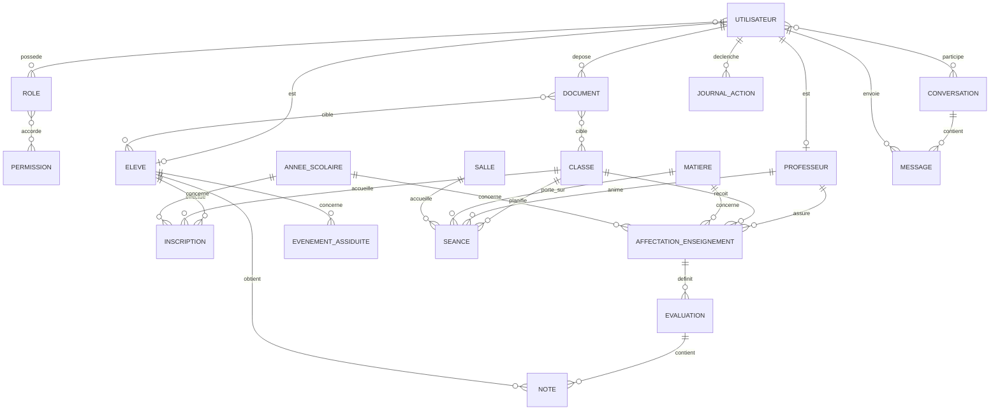

# Modèle conceptuel de données

## Objectif

Ce document décrit les données métier nécessaires à l'application et leurs relations. Il sert de base au futur schéma relationnel et aux migrations de base de données.

Les noms sont conceptuels : les noms techniques des tables et des colonnes seront définis lors du passage au modèle logique de données.

## Vue d'ensemble

## Entités

### Identités et autorisations

| Entité | Rôle dans le système | Attributs principaux |
| --- | --- | --- |
| Utilisateur | Compte permettant l'accès à l'application | identifiant, nom, prénom, adresse électronique, mot de passe protégé, état du compte, date de création |
| Rôle | Ensemble de droits attribuable à un compte | identifiant, libellé, description |
| Permission | Action autorisée dans une fonctionnalité | identifiant, code, description |
| Élève | Profil scolaire associé à un utilisateur | identifiant, utilisateur associé, identifiant interne, date de naissance, coordonnées |
| Professeur | Profil enseignant associé à un utilisateur | identifiant, utilisateur associé, identifiant interne, coordonnées |

Les rôles initiaux sont : Élève, Professeur, Administration et Administrateur.

### Organisation scolaire

| Entité | Rôle dans le système | Attributs principaux |
| --- | --- | ---|
| Année scolaire | Période de référence pour les données scolaires | identifiant, libellé, date de début, date de fin, état |
| Classe | Groupe principal d'élèves | identifiant, libellé, niveau, capacité |
| Matière | Discipline enseignée | identifiant, libellé, code, description |
| Inscription | Affectation d'un élève à une classe pour une année scolaire | identifiant, élève, classe, année scolaire, date d'inscription, état |
| Affectation d'enseignement | Attribution d'une matière et d'une classe à un professeur | identifiant, professeur, classe, matière, année scolaire |

L'entité Inscription conserve l'historique : un élève peut changer de classe d'une année à l'autre sans perdre ses données antérieures.

### Scolarité

| Entité | Rôle dans le système | Attributs principaux |
| --- | --- | --- |
| Évaluation | Travail noté créé par un professeur | identifiant, affectation d'enseignement, libellé, date, coefficient, barème |
| Note | Résultat d'un élève pour une évaluation | identifiant, évaluation, élève, valeur, commentaire, date de saisie |
| Événement d'assiduité | Absence ou retard d'un élève | identifiant, élève, type, début, fin, motif, état de justification |
| Séance | Créneau de cours inscrit dans l'emploi du temps | identifiant, classe, professeur, matière, salle, début, fin |
| Salle | Lieu où se déroule une séance | identifiant, libellé, capacité, localisation |

### Échanges et documents

| Entité | Rôle dans le système | Attributs principaux |
| --- | --- | --- |
| Document | Fichier ou ressource partagée | identifiant, nom, emplacement de stockage, type, taille, date de dépôt, déposant |
| Conversation | Espace d'échange entre plusieurs utilisateurs | identifiant, objet, date de création, état |
| Participant à une conversation | Association entre un utilisateur et une conversation | conversation, utilisateur, date d'ajout, date de dernière lecture |
| Message | Message envoyé dans une conversation | identifiant, conversation, auteur, contenu, date d'envoi, date de lecture |
| Document-classe | Association d'un document à une ou plusieurs classes | document, classe |
| Document-élève | Association d'un document à un ou plusieurs élèves | document, élève |

### Traçabilité

| Entité | Rôle dans le système | Attributs principaux |
| --- | --- | --- |
| Journal des actions | Historique des opérations sensibles | identifiant, utilisateur, action, ressource concernée, date, adresse réseau, détail |

## Relations et cardinalités

| Relation | Cardinalité | Règle métier |
| --- | --- | --- |
| Utilisateur - Rôle | 0,n vers 0,n | Un utilisateur peut recevoir plusieurs rôles ; un rôle peut être attribué à plusieurs utilisateurs. |
| Rôle - Permission | 0,n vers 0,n | Une permission peut appartenir à plusieurs rôles. |
| Utilisateur - Élève / Professeur | 0,1 vers 1,1 | Un profil élève ou professeur est lié à un seul compte. Un compte peut ne correspondre à aucun de ces profils, par exemple pour l'administration. |
| Élève - Inscription - Classe - Année scolaire | 0,n vers 1,1 | Une inscription associe exactement un élève, une classe et une année scolaire. |
| Professeur - Affectation d'enseignement - Classe - Matière - Année scolaire | 0,n vers 1,1 | Une affectation définit qui enseigne quelle matière à quelle classe pour une année donnée. |
| Évaluation - Note - Élève | 0,n vers 1,1 | Une note correspond à un seul élève et une seule évaluation. Un élève ne peut avoir qu'une note par évaluation. |
| Élève - Événement d'assiduité | 0,n vers 1,1 | Chaque événement concerne un élève ; son type est absence ou retard. |
| Conversation - Utilisateur | 1,n vers 0,n | Une conversation comprend au moins un participant ; un utilisateur peut participer à plusieurs conversations. |
| Conversation - Message | 0,n vers 1,1 | Un message appartient à une seule conversation et possède un seul auteur. |
| Document - Classe / Élève | 0,n vers 0,n | Un document peut cibler plusieurs classes ou élèves, et inversement. |
| Utilisateur - Journal des actions | 0,n vers 1,1 | Une action journalisée est liée à son auteur lorsqu'il est identifié. |

## Règles de gestion essentielles

1. Seuls les utilisateurs authentifiés peuvent accéder aux données.
2. Un professeur ne peut gérer les notes, absences et documents que pour ses affectations d'enseignement.
3. Un élève ne peut consulter que ses propres résultats, absences, documents et emploi du temps.
4. Les suppressions de données sensibles doivent être limitées et journalisées.
5. Les documents ne sont accessibles qu'aux utilisateurs explicitement concernés.
6. Une évaluation et une note sont rattachées à une année scolaire via l'affectation d'enseignement.
7. Les données de démonstration ne doivent contenir aucune donnée personnelle réelle.

## Décisions à valider avant le modèle logique

- Confirmer si un professeur peut assurer la même matière pour plusieurs groupes d'une classe.
- Définir les motifs d'absence, les états de justification et les personnes habilitées à les modifier.
- Définir les règles de calcul des moyennes : arrondi, pondération, périodes et rattrapages.
- Définir le format des fichiers acceptés, leur durée de conservation et leur taille maximale.
- Définir si les notifications sont internes à l'application, par courrier électronique, ou les deux.
- Confirmer si une salle doit être obligatoire pour chaque séance.
