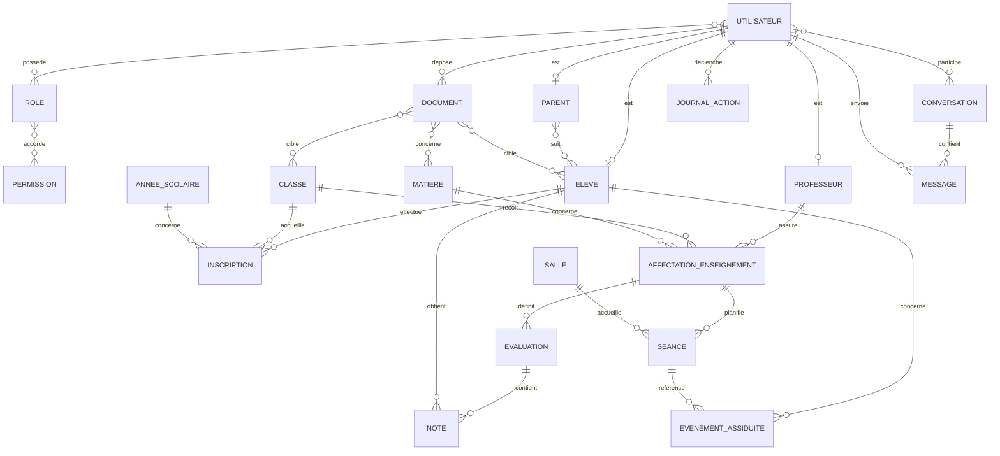

# Modèle conceptuel de données

## Objectif

Ce modèle décrit les données métier et leurs relations. Il constitue la référence fonctionnelle du futur modèle EF Core.

## Vue d'ensemble

```mermaid
erDiagram
    UTILISATEUR }o--o{ ROLE : possede
    ROLE }o--o{ PERMISSION : accorde
    UTILISATEUR ||--o| ELEVE : est
    UTILISATEUR ||--o| PROFESSEUR : est
    UTILISATEUR ||--o| PARENT : est
    PARENT }o--o{ ELEVE : suit
    ELEVE ||--o{ INSCRIPTION : effectue
    CLASSE ||--o{ INSCRIPTION : accueille
    ANNEE_SCOLAIRE ||--o{ INSCRIPTION : concerne
    PROFESSEUR ||--o{ AFFECTATION_ENSEIGNEMENT : assure
    CLASSE ||--o{ AFFECTATION_ENSEIGNEMENT : recoit
    MATIERE ||--o{ AFFECTATION_ENSEIGNEMENT : concerne
    AFFECTATION_ENSEIGNEMENT ||--o{ EVALUATION : definit
    EVALUATION ||--o{ NOTE : contient
    ELEVE ||--o{ NOTE : obtient
    ELEVE ||--o{ EVENEMENT_ASSIDUITE : concerne
    SEANCE ||--o{ EVENEMENT_ASSIDUITE : reference
    AFFECTATION_ENSEIGNEMENT ||--o{ SEANCE : planifie
    SALLE ||--o{ SEANCE : accueille
    DOCUMENT }o--o{ CLASSE : cible
    DOCUMENT }o--o{ ELEVE : cible
    DOCUMENT }o--o{ MATIERE : concerne
    CONVERSATION ||--o{ MESSAGE : contient
    UTILISATEUR ||--o{ MESSAGE : envoie
    UTILISATEUR }o--o{ CONVERSATION : participe
    UTILISATEUR ||--o{ DOCUMENT : depose
    UTILISATEUR ||--o{ JOURNAL_ACTION : declenche
```

## Entités

### Identités et autorisations

- **Utilisateur** : compte de connexion.
- **Rôle** : ensemble de droits fonctionnels.
- **Permission** : action unitaire autorisée.
- **Élève** : profil scolaire lié à un utilisateur.
- **Professeur** : profil enseignant lié à un utilisateur.
- **Parent** : profil parent lié à un utilisateur.
- **Parent-Élève** : association permettant de rattacher un parent à un ou plusieurs enfants.

Rôles initiaux : Élève, Professeur, Parent, Administration, Administrateur.

### Organisation scolaire

- Année scolaire ;
- Classe ;
- Matière ;
- Inscription ;
- Affectation d'enseignement.

L'inscription conserve l'historique scolaire. Une affectation d'enseignement identifie le professeur, la classe, la matière et l'année.

### Scolarité

- Évaluation ;
- Note ;
- Événement d'assiduité ;
- Salle ;
- Séance.

Une séance est rattachée à une affectation d'enseignement. Une absence ou un retard peut référencer la séance concernée.

### Documents

Un document possède des métadonnées en base et un fichier stocké sur le volume serveur. Il peut être ciblé par classe, élève et matière.

### Messagerie

Les conversations possèdent des participants et des messages. SignalR ne remplace pas ces données persistées : il diffuse les nouveaux messages en temps réel.

### Traçabilité

Le journal des actions conserve les opérations sensibles avec leur auteur lorsqu'il est identifié, la ressource concernée, la date et les détails utiles.

## Règles métier essentielles

1. Les données sont accessibles uniquement après authentification.
2. L'autorisation est contrôlée côté API.
3. Un professeur ne gère que les données relevant de ses affectations.
4. Un élève consulte uniquement ses données.
5. Un parent consulte uniquement les données des élèves auxquels il est rattaché.
6. Une note appartient à une évaluation et un élève ; une note par évaluation et par élève.
7. Une évaluation est rattachée à une affectation d'enseignement.
8. Les suppressions sensibles sont limitées, et les opérations administratives importantes sont auditées.
9. Les fichiers sont soumis à une validation de type, taille et autorisation avant stockage.
