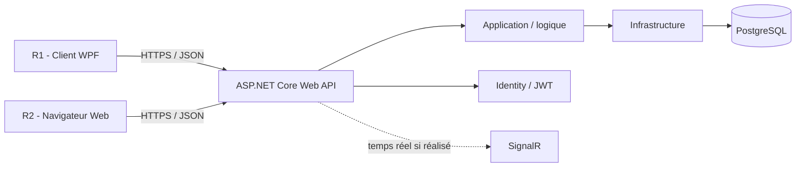
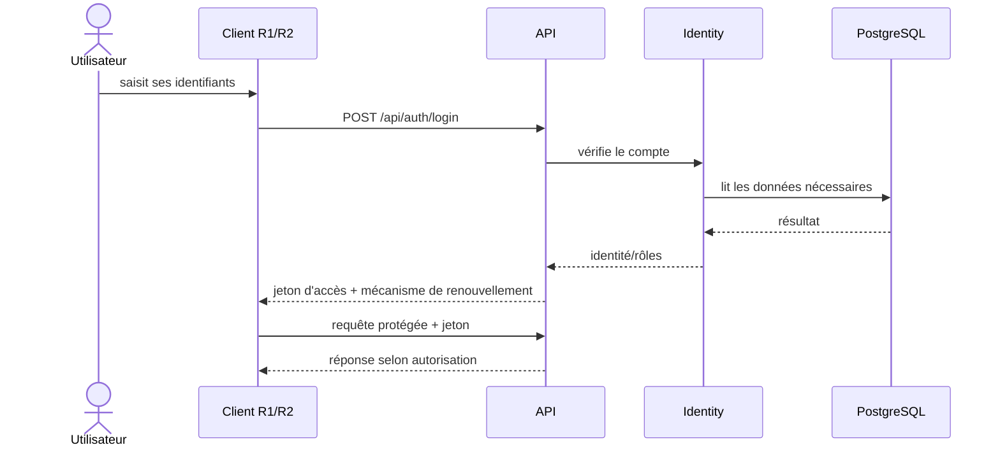
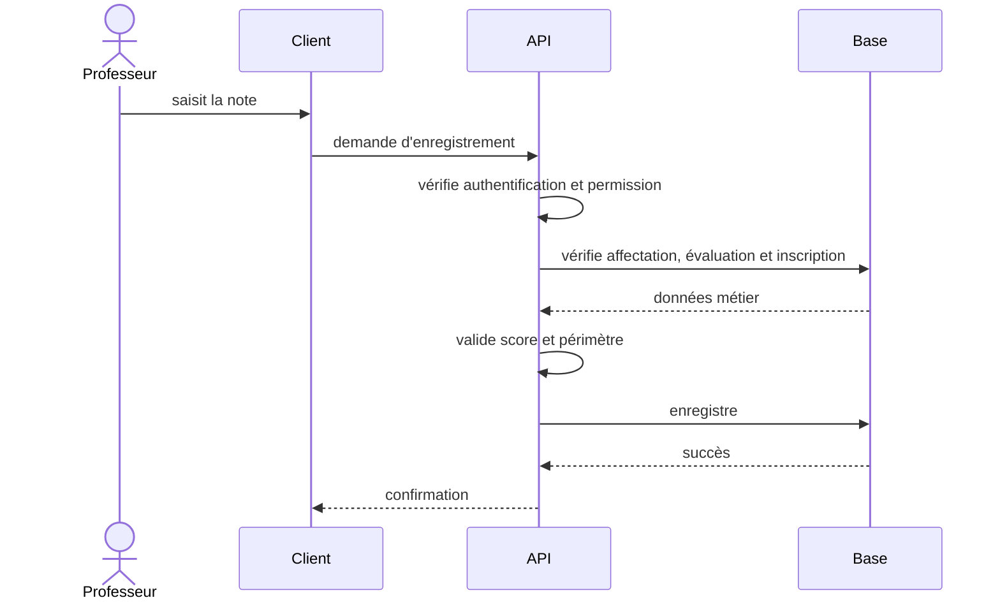
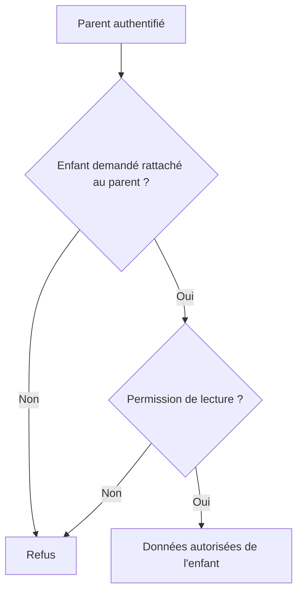
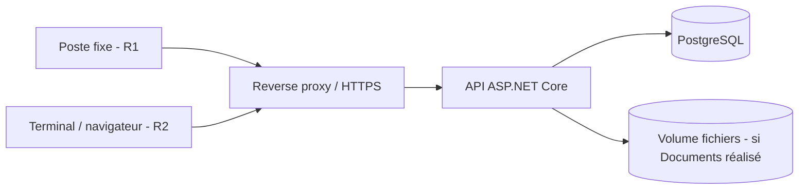

# Diagrammes de conception — EduGest

Ces diagrammes décrivent la cible actuelle. Ils devront évoluer si l'implémentation réellement retenue change.

## Architecture générale

Principe : aucun client n'accède directement à PostgreSQL.

## Authentification

## Saisie d'une note — logique cible

Le contrôle « professeur réellement affecté » est une règle cible à garantir dans l'implémentation finale ; le diagramme ne constitue pas une preuve qu'elle est déjà codée.

## Parent consultant un enfant

## Déploiement cible

Le nombre de serveurs, leurs OS et les outils de sécurité de l'environnement E6 restent à valider avec l'établissement.
